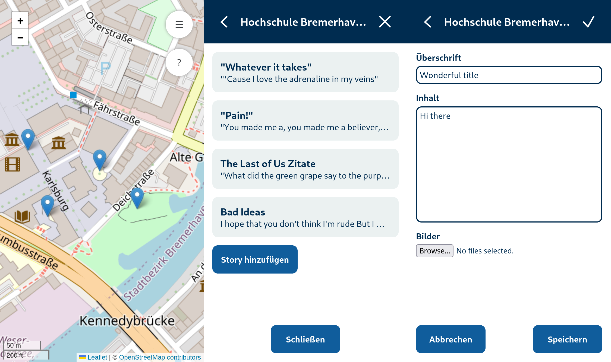

# Kartr [ˈKạrtɾ]

Kartr is a web application based on OpenStreetMap, where users can share
stories and pictures associated to specific locations, creating a
collaborative exploration guide and story collection.

## System architecture

### Java EE Application Server

The software was built using a WildFly 26.1.1. It's important to set the
character encoding to UTF-8. You also need to setup the datasources (see
section [Installation](#Installation))

### Database

The software uses a PostgreSQL database. The database keeps track of account
data, Points of Interest (POIs), stories and filenames for media attached to
stories. The version being used is PostgreSQL 16.

The datasource for the Servlets of a deployment is selected using a .properties
file generated in the mkanddeploy.sh script (key datasource).

### Storage backend

Media files are stored directly on the file system with a random and unique
file name. The database holds a reference to that file name to build relations
between stories and the corresponding media.

The storage directory is defined in a .properties file generated in the
mkanddeploy.sh script (key upload_base_dir).

### Reverse Proxy

We used HAProxy as a TLS terminating reverse proxy, but this is not mandatory
when using this software.

### Tile Server

The software requires a tile server that generates map tiles to be displayed.
It is possible to either build the tile server with the scripts provided on
[project-kartr/openstreetmap-management-scripts](https://github.com/project-kartr/openstreetmap-management-scripts)
or use the public OSM-Server instead.

## Contributing

Please file a GitHub Pull Request for your change.  
If you do not have a GitHub Account, you may send in your patch at
[project-kartr@bunuki.de](mailto:project-kartr@bunuki.de).

## Licensing

### Source Code License

Source Code from this project is, unless otherwise stated, subject to the terms
of the **Mozilla Public License, v. 2.0**.

You may, however, change the web-site icons located in
`app/images/icons/icon-*.png` to your own icons for your deployment without
publishing that as a change to the project source
(regardles of the terms of the MPL-2.0).

### Copyright Notices regarding images

The Kartr Logo © 2022 by Murad Rustamov is licensed under
[CC BY-SA 4.0](http://creativecommons.org/licenses/by-sa/4.0/)

### Used Libraries

Some libraries used by this project are licensed under different terms. The
license texts are located in `licenses/`.

| Library | License |
| ------- | ------- |
| Guava | Apache 2.0 |
| Jakarta JSON Processing API | EPL 2.0 |
| Jakarta Mail API | EPL 2.0 |
| Jakarta Servlet | EPL 2.0 |
| OWASP Java HTML Sanitizer | Apache 2.0 |
| Leaflet | BSD-2-Clause |

## Project contact

For issues or questions not regarding the code of this project, please contact
[Oliver Radfelder](mailto:oradfelder@hs-bremerhaven.de) at the University of
Applied Sciences Bremerhaven.
